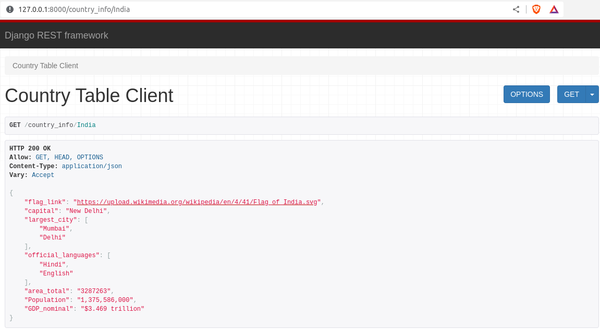
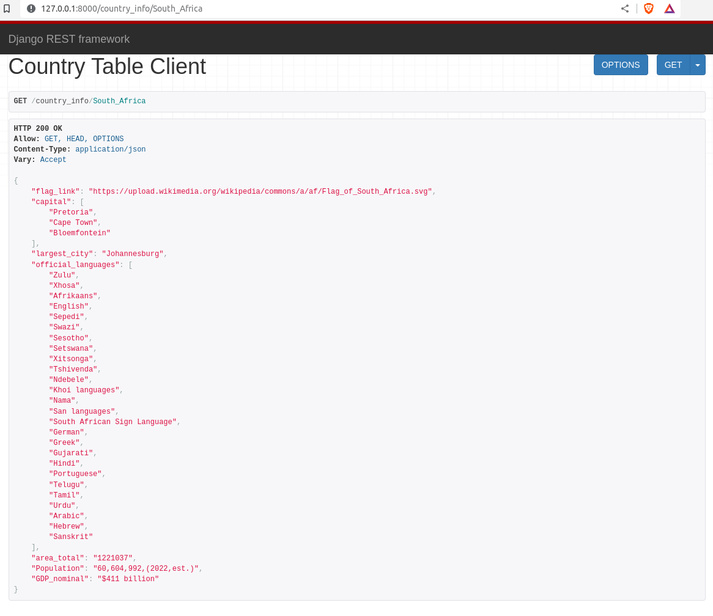

# <div align="center"> Wikilog </div>


## Instructions
1. Install dependencies bu running 
```python
$ python3 install -r requirements.txt
```
2. Run following command on terminal to start the django server.

```python
$ python3 manage.py runserver
```

## Sample Output

> http://127.0.0.1:8000/country_info/India



<br/>

> http://127.0.0.1:8000/country_info/South_Africa



